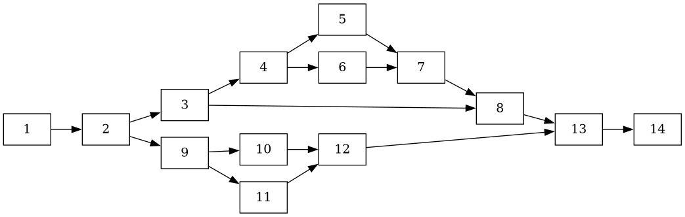
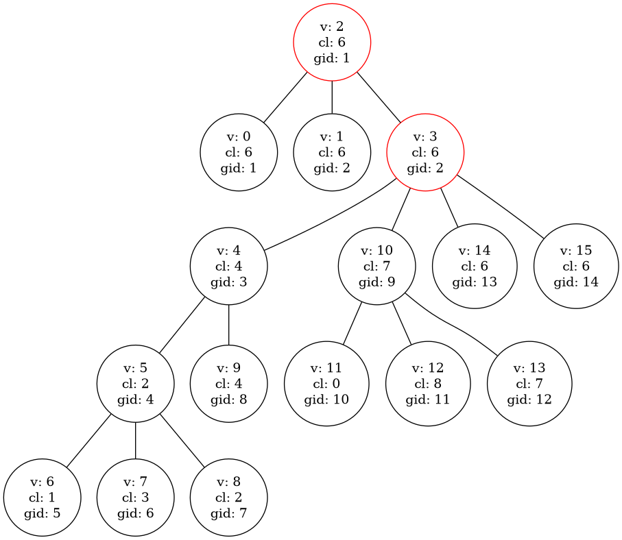

# povu
Variant caller based on cycle equivalence

# Input
Input GFA

Expect a sorted graph in GFA
Expect first node to have id 1

Compile
```
cmake -H. -Bbuild && cmake --build build -- -j 3
```

Run
```
./bin/povu
```

Example
```
./bin/povu -v 2 call -i test_data/LPA.max120.gfa  --  HG02572__LPA__tig00000001
```

## Development

Compile with debug symbols
```
cmake -DCMAKE_BUILD_TYPE=Debug -H. -Bbuild && cmake --build build -- -j 3
```

A release version (default)
```
cmake -DCMAKE_BUILD_TYPE=Release -H. -Bbuild && cmake --build build -- -j 3
```

## Pangenome Variation Structure Tree (PVST)

You can use `-t` to generate the PVST in `.pvst` format which is a is a tab
separated plain text file made up of 5 columns as described below


| type                      | description                                                                                    |
|---------------------------|------------------------------------------------------------------------------------------------|
| unsigned numeric          | vertex id (can be zero)                                                                        |
| list of unsigned numerics | child nodes in comma separated values                                                          |
| character                 | A value indicating whether the node is a true vertex or a dummy vertex (D for dummy, T for true)                         |
| unsigned numeric          | the equivalence class of the vertex                                                            |
| unsigned numeric          | the id of the vertex in the GFA file (multiple different vertex ids can share the same GFA id) |

### Example




```
0		T	6	1
1		T	6	2
2	0,1,3	D	6	1
3	10,14,15,4	D	6	2
4	5,9	T	4	3
5	6,7,8	T	2	4
6		T	1	5
7		T	3	6
8		T	2	7
9		T	4	8
10	11,12,13	T	7	9
11		T	0	10
12		T	8	11
13		T	7	12
14		T	6	13
15		T	6	14

```
